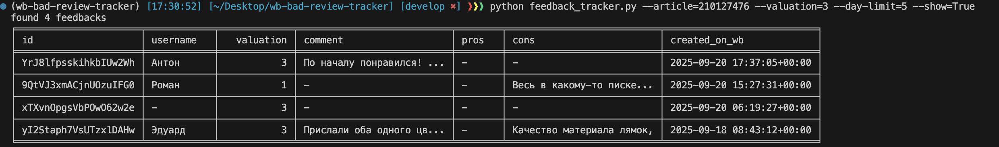

## Description
Util for WB scrapping and filtering feedbacks of product

## Setup

### ✅ Prerequisites

- [Python](https://www.python.org/) (3.11+ recommended)
- [uv](https://docs.astral.sh/uv/getting-started/installation/)

1. Clone the repository and install dependencies
    ```bash
    git clone https://github.com/maximSytd/WB-bad-reivew-tracker.git &&
    cd WB-bad-reivew-tracker && uv sync --active && cp .env.example .env
    ```

2. Specify Postgres connection in .env file, or use local config with docker compose

    ```bash
    docker-compose up -d
    ```

3. Apply migration to db
    ```bash
    aerich upgrade
    ```

4. Usage
    ```bash
    python feedback_tracker.py --article=210127476 --valuation=3 --day-limit=5 --show=True
    ```
    Example output:
    